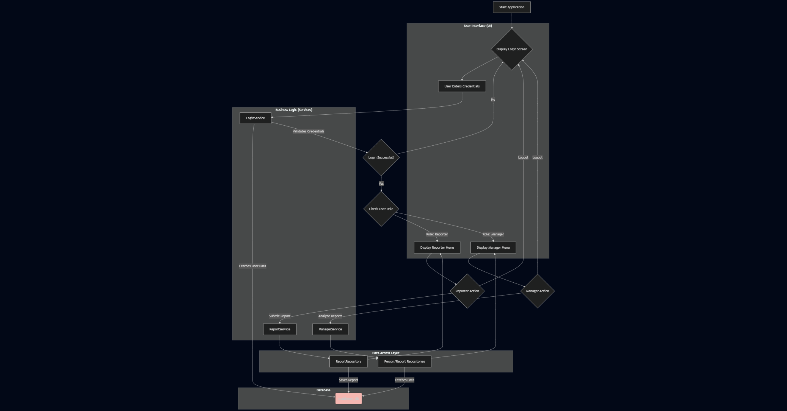

# Malshinon - Community Intel Reporting System

[](https://github.com/shemaryahuz)

---

## Overview

**Malshinon** is a Community Intel Reporting System designed for hostile environments or organizations, where a community of *enemies* is tracked with the help of *reporters* and *targets*.  
Reporters submit intelligence about potential threats, dangerous targets, and possible agent candidates.  
Managers can analyze reports to identify dangerous targets and spot potential agents among reporters or targets.

---

## Folder Structure

```plaintext
Malshinon/
├── .gitignore
├── MalshinonApp/
│   ├── MalshinonApp.csproj
│   ├── MalshinonApp.sln
│   ├── Program.cs
│   ├── Data/
│   │   ├── DatabaseContext.cs
│   │   ├── PersonRepository.cs
│   │   └── ReportRepository.cs
│   ├── Models/
│   │   ├── Manager.cs
│   │   ├── Person.cs
│   │   ├── Reporter.cs
│   │   ├── Target.cs
│   │   └── Report.cs
│   ├── Services/
│   │   ├── LoginService.cs
│   │   ├── ManagerService.cs
│   │   └── ReportService.cs
│   └── UI/
│       ├── ConsoleManager.cs
│       ├── LoginDisplayer.cs
│       ├── ManagerMenu.cs
│       └── ReporterMenu.cs
├── MalshinonDB/
│   └── malshinon_db.sql
```

---

## Program Architecture & Flow

> **Program Flow Diagram**  
>   

---

## Database

- **Setup:**  
  - The database is initialized using the SQL script (`MalshinonDB/malshinon_db.sql`).
  - Requires a local SQL environment.
- **Tables:**
  - `people`: Contains all users (managers, reporters, targets).
  - `intel_reports`: Stores intelligence reports (`reporterId`, `targetId`, `text`, `time`).
- **Initialization:**  
  - The database comes with sample data for testing.

---

## Author

[Shemaryahu Zalmanov](https://github.com/shemaryahuz)

---

## Getting Started

1. **Clone the repository**  
   ```bash
   git clone https://github.com/shemaryahuz/Malshinon.git
   cd Malshinon
   ```
2. **Set up the Database**  
   - Install a SQL environment if needed.
   - Run `MalshinonDB/malshinon_db.sql` to create and initialize `malshinon_db`.

3. **Build and Run the Application**  
   - Open the solution in Visual Studio or another C# IDE.
   - Build and run the application from the `MalshinonApp` folder.
